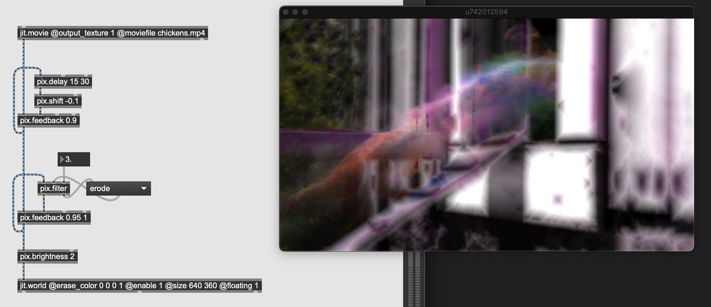

# Pix Shaders v.2.0

**Find my Audiovisual projects on http://gumroad.com/tmhglnd**

**Consider to become a patron on http://patreon.com/timohoogland**

---

## About

A small package of various pixel shaders for processing textures in the Jitter OpenGL world. The abstractions give quick access to disable/enabling of the shaders, and setting parameters through lists of values or single values in inlets. Some are simply a wrapper for a jit.gl.slab object loaded with a shader that is shipped with Max8. Some are wrapped around a shader ported from shadertoy or coded by other creative minds! Original sources listed below. Others are shaders that I regularly use myself and coded for ease of reuse. The comments on the inlet explain the order of parameters. Open the help-patcher for further details and workings.

## New

`pix.blend`, `pix.displace`, `pix.delay`, `pix.feedback`, `pix.filter`, `pix.grid`, `pix.pong`, `pix.shift`, `pix.sort`, `pix.static`, `pix.xfade`




## Contains

- **pix.blend** - *Blend 2 textures with different modes such as average, difference, exclude, darken, screen, etc.*

- **pix.blur** - *Add a focus- or tilt-blur effect, similar to instagram filter blur*

- **pix.brcosa** - *Adjust brightness, contrast and saturation of a texture*

- **pix.brightness** - *Adjust brightness of a texture*

- **pix.chromakey** - *Chromakey a texture, outputting the same texture with a alphachannel for the keyed color*

- **pix.contrast** - *Adjust contrast of a texture*

- **pix.degrade** - *Downsample the resolution or the colordepth of the texture*

- **pix.delay** - *Delay a texture an n-amount of frames*

- **pix.displace** - *Displace a texture's pixel positions with the input of another texture*

- **pix.duotone** - *Change a texture to two colors based on grayscale*

- **pix.edgedetect** - *Detect edges in a texture and output a black/white texture only showing detected edges*

- **pix.feedback** - *Create a feedback loop with different blending modes such as mix-max, mix-min, mix and additive*

- **pix.filter** - *Apply various convolution filters such as dilate, emboss, laplace, sobel, etc.*

- **pix.frame** - *Add a border surrounding the texture, adjust border width and color*

- **pix.glitch** - *Displace the green component of a texture with a low resolution noise matrix. Adjust displace distance, variation and dimensions of noise (was pix.displace)*

- **pix.grid** - *Generate a simple grid texture of lines*

- **pix.noise** - *Add gpu noise to an image, adjust threshold, smoothing and add/subtraction from texture*

- **pix.pong** - *Similar to the `pong` and `pong~` objects, applying a fold, wrap or clip to a texture*

- **pix.saturation** - *Adjust saturation of a texture*

- **pix.shift** - *Shift the hue (color value) of a texture*

- **pix.sort** - *Simple pixelsorting by comparing current pixel with an adjecent pixel in adjustable direction and output the higher hue value* 

- **pix.static** - *Output noise for the dimension of the incoming texture*

- **pix.technicolor1** - *A technicolor shader - results in a orange/brown tint*

- **pix.technicolor2** - *A technicolor shader - results in a white/purple tint*

- **pix.technicolor3** - *A technicolor shader - results in a red/yellow tint*

- **pix.xfade** - *Similar to `jit.xfade`, linear interpolation between 2 textures*

## Sources

Technicolor pixel shaders ported from the original GLSL shaders by vade

- http://001.vade.info

GPU Noise algorithm based on 

- http://byteblacksmith.com/improvements-to-the-canonical-one-liner-glsl-rand-for-opengl-es-2-0/

Duotone gen-code loosly based on Micron's patch

- https://www.patreon.com/posts/easy-duotone-19824702

## Install

Download zip
```
1. download zip
2. unzip and place in Max Searchpath (eg. MacOS ~/Documents/Max 8/Library)
3. restart Max8
```
Git clone
```
1. $ cd ~/Documents/Max\ 8/Library
2. $ git clone https://github.com/tmhglnd/gl-pix-shaders.git
3. restart Max8
```
To see overview of all objects
```
open pix-shaders-launch.maxpat
```
## License

This software is licensed under:

The MIT License
